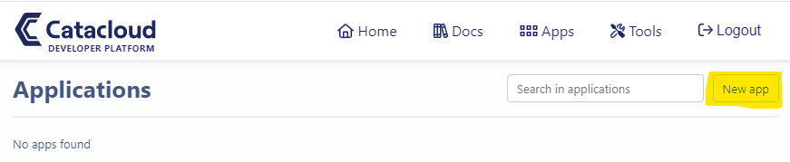
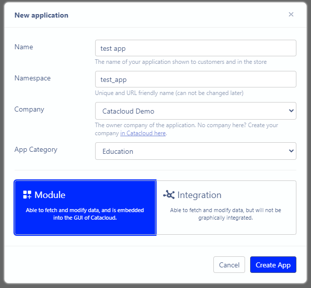
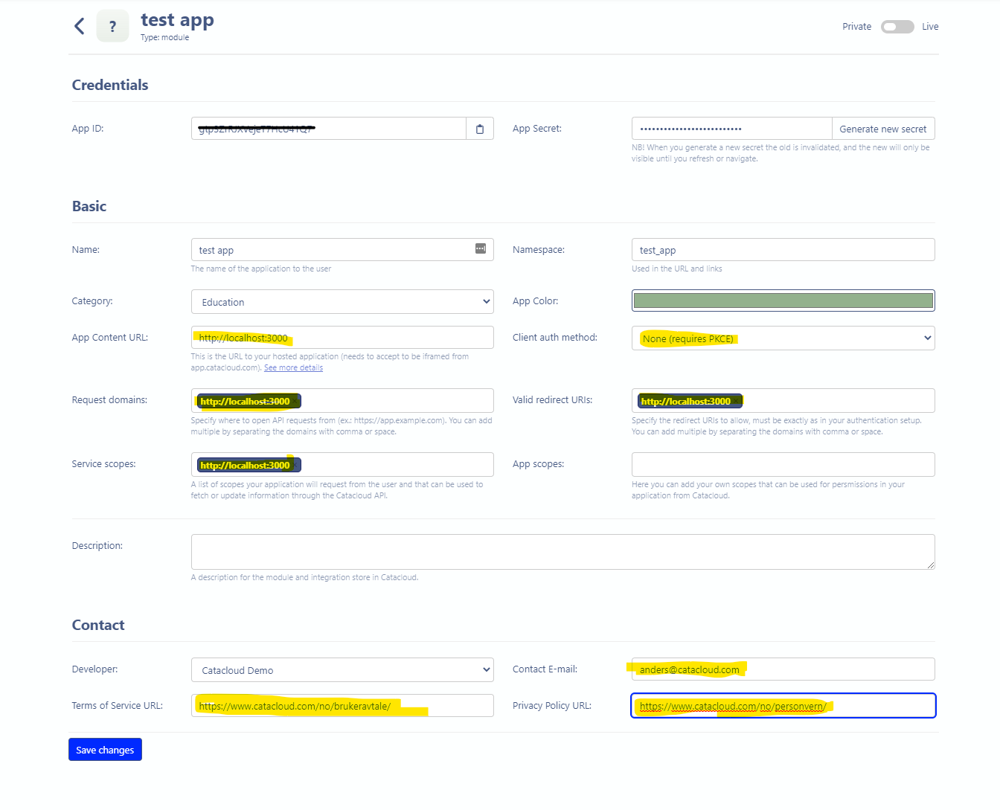
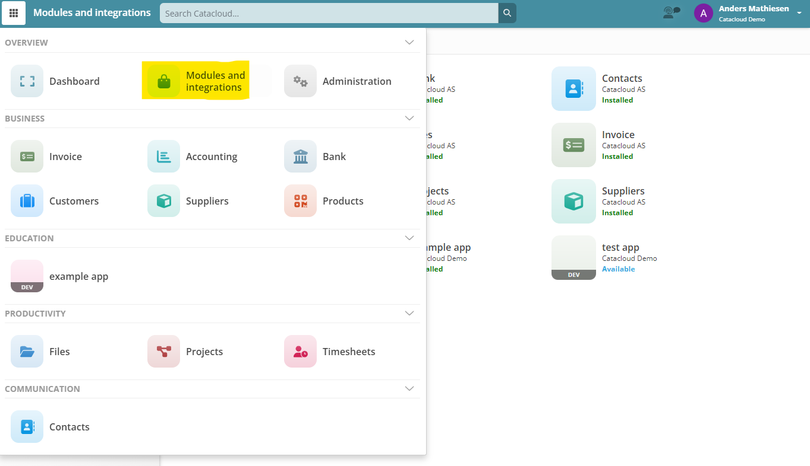

See [web page](https://catacloud-example-app.vercel.app)

### Integrate with Catacloud

1. Find a [oidc](https://openid.net/connect/) library for your language
   1. We uses [oidc-client-ts](https://www.npmjs.com/package/oidc-client-ts) and [react-oidc-context](https://www.npmjs.com/package/react-oidc-context)
2. First get configuration from [catacloud developers](https://developers.catacloud.com/apps)
   1. Login if you haven't already
   2. 
   3. Click on 
   4. Create a .env and copy the content of .env.example
   5. Copy App ID and App Secret into env and full out the yellow input fields 
3. Test if your app exists in catacloud.com
   1. Go to the [client](https://app.catacloud.com/) you selected in 2. ii.
   2. 
   3. Click on your app and install it
   4. Login out and in again to see the app
4. To get token from app.catacloud.com see `utils/getToken.ts`
